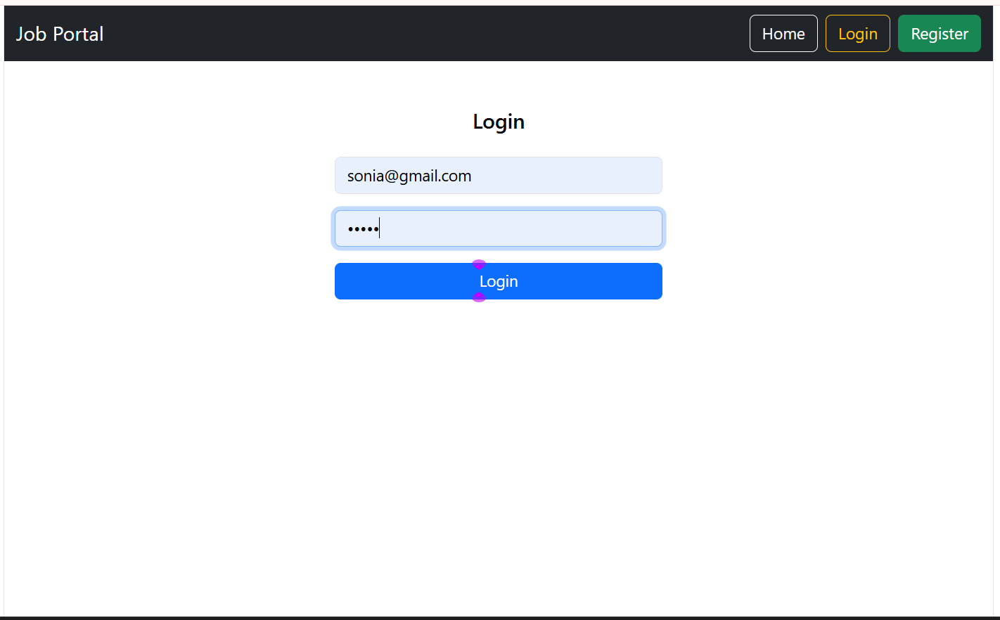
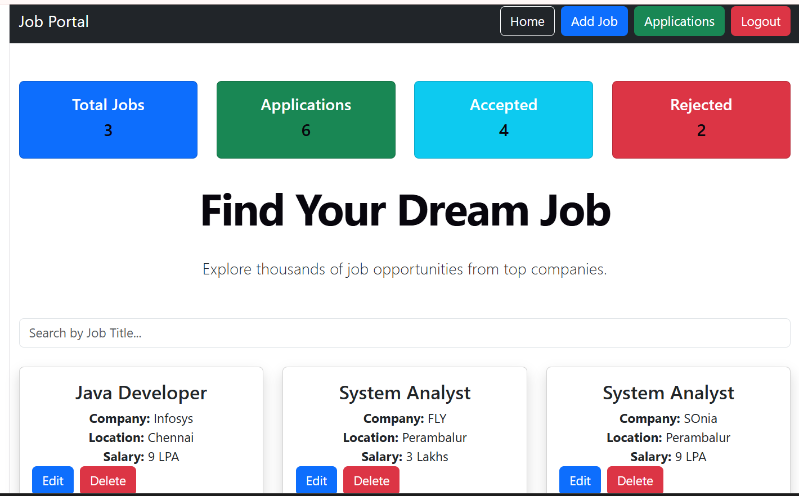
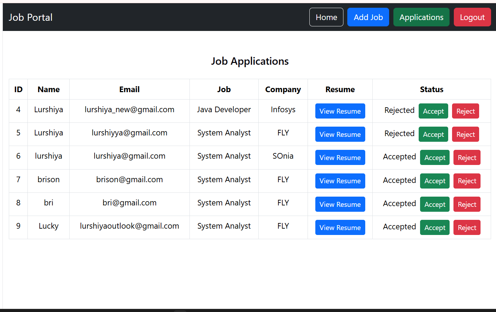
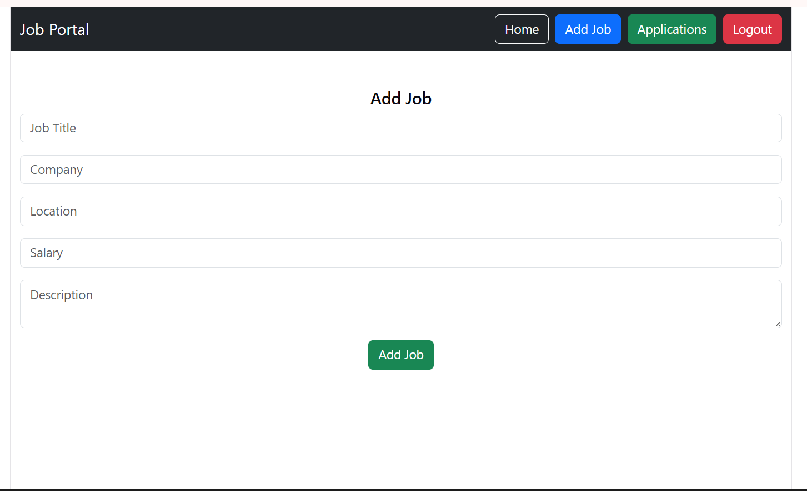
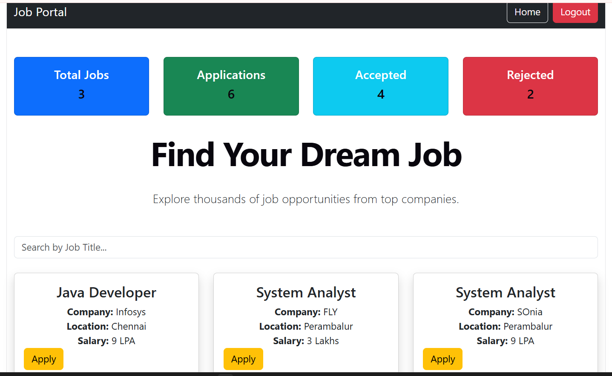

# Online Job Portal System

## About Project
Online Job Portal System is a web application that allows users to register, search jobs, apply for jobs and track application status.

## Technologies Used
- Java
- Spring Boot
- React JS
- MySQL
- REST API
- HTML
- CSS
- JavaScript

## Features
- User Registration and Login
- Company Registration
- Job Posting
- Search Jobs
- Apply for Jobs
- Resume Upload
- Application Status Tracking
- Admin Dashboard

## Project Structure
- Backend: Spring Boot REST API
- Frontend: React JS
- Database: MySQL

## How to Run
1. Clone the repository
2. Configure MySQL database
3. Run Spring Boot backend
4. Start React frontend

## Project Screenshots

### Login Page

### Admin Home Page

### Admin Application Page

### Admin Add Job Page

### User Home Page

